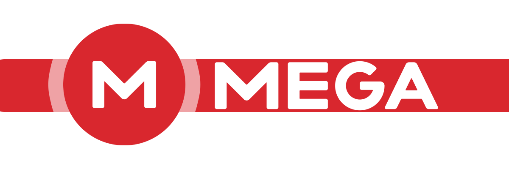
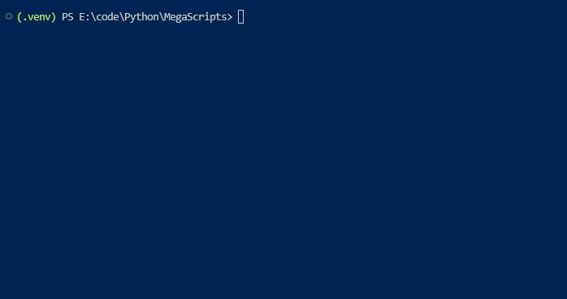

<h1 align="center">
  
  <br>
  MEGA.nz Account Creator
</h1>

<h4 align="center">An Open Source demonstration of creating / managing multiple  <a href="https://mega.nz" target="_blank">MEGA.nz</a> accounts.</h4>

<br>

<p align="center">
  <!--License-->
  <a href="https://github.com/f-o/MEGA-Account-Generator/blob/master/LICENSE">
      
  </a>
  <!--Contributions-->
  <a href="https://github.com/f-o/MEGA-Account-Generator/graphs/contributors" alt="Contributors">
      
  </a>
  <!--Stars-->
  <a href="https://github.com/f-o/MEGA-Account-Generator/stargazers">
      
  </a>
  <!--Donate-->
  <a href="#support">
    
  </a>
</p>

<p align="center">
  <a href="#key-features">Key Features</a> •
  <a href="#how-to-use">How To Use</a> •
  <a href="#acknowledgements">Acknowledgements</a> •
  <a href="#support">Support</a> •
  <a href="#license">License</a>
</p>
<div align="center">
  
</div>

<br>

## Key Features

* Generate new MEGA.nz accounts in bulk
* Automatically verify emails
* Keep accounts alive by logging in periodically

<br>

## How To Use

**Prerequisites:**
* [megatools](https://megatools.megous.com/) installed and added to your PATH
* Python 3.6+

**Installation:**
```bash
# Clone this repository
$ git clone https://github.com/f-o/MEGA-Account-Generator.git
# Go into the repository
$ cd MEGA-Account-Generator
# Install dependencies
$ pip install -r requirements.txt
```

**Usage:**
```bash
# Create new accounts
$ python generate_accounts.py [-h] [-n NUMBER_OF_ACCOUNTS] [-p PASSWORD]
# Sign in to accounts to keep them alive
$ python signin_accounts.py
```


<br>

## Acknowledgements

This software was based heavily on [IceWreck/MegaScripts](https://github.com/IceWreck/MegaScripts).<br>
His original Python script utilized [GuerillaMail](https://www.guerrillamail.com/GuerrillaMailAPI.html) to generate temporary email addresses.<br>
I've modified the script to use [Mail.tm](https://api.mail.tm/) instead, with a lot of help from [qtchaos/py_mega_account_generator](https://github.com/qtchaos/py_mega_account_generator).<br>
I highly recommend checking out both of their projects.


## Support
This project is free and open source.<br>
If you find it useful, please consider supporting the project by donating.
<br><br>
<a href="https://www.buymeacoffee.com/foxdev" target="_blank"></a>

<br>

## License

[MIT License](https://mit-license.org/)
```
Copyright (c) 2023 Fox

Permission is hereby granted, free of charge, to any person obtaining a copy
of this software and associated documentation files (the "Software"), to deal
in the Software without restriction, including without limitation the rights
to use, copy, modify, merge, publish, distribute, sublicense, and/or sell
copies of the Software, and to permit persons to whom the Software is
furnished to do so, subject to the following conditions:

The above copyright notice and this permission notice shall be included in all
copies or substantial portions of the Software.

THE SOFTWARE IS PROVIDED "AS IS", WITHOUT WARRANTY OF ANY KIND, EXPRESS OR
IMPLIED, INCLUDING BUT NOT LIMITED TO THE WARRANTIES OF MERCHANTABILITY,
FITNESS FOR A PARTICULAR PURPOSE AND NONINFRINGEMENT. IN NO EVENT SHALL THE
AUTHORS OR COPYRIGHT HOLDERS BE LIABLE FOR ANY CLAIM, DAMAGES OR OTHER
LIABILITY, WHETHER IN AN ACTION OF CONTRACT, TORT OR OTHERWISE, ARISING FROM,
OUT OF OR IN CONNECTION WITH THE SOFTWARE OR THE USE OR OTHER DEALINGS IN THE
SOFTWARE.
```

> [@f-o](https://github.com/f-o) &nbsp;&middot;&nbsp;
> [soon.to](https://soon.to)